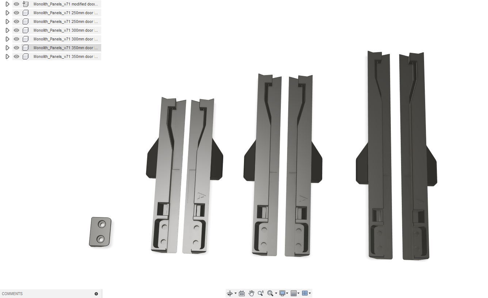

# Monolith panels door bottom parts mod for PITFT50 and HDMI5 screens
Those screens printed part holder or outer dimensions are 128mm wide so the handle is moved 65mm to the side.

For Voron sizes available:
- 250mm
- 300mm
- 350mm

### Note: Please use shorter inserts for plastic parts, 4mm is enough and 5mm could be too long.

Original design can be found here: https://github.com/CloakedWayne/Monolith_Panels